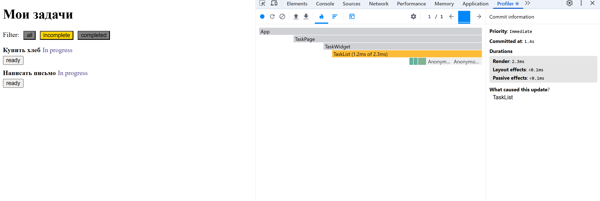
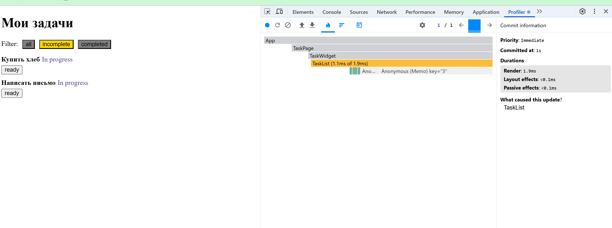
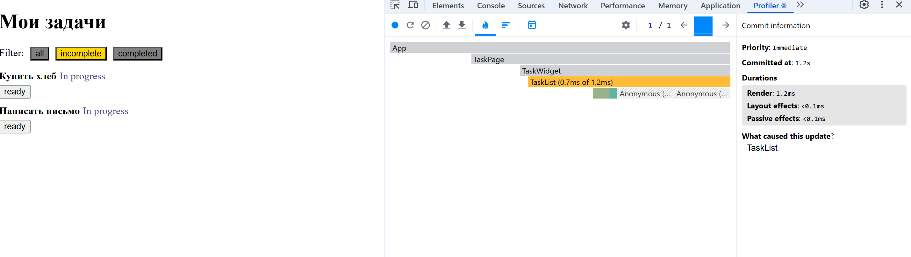
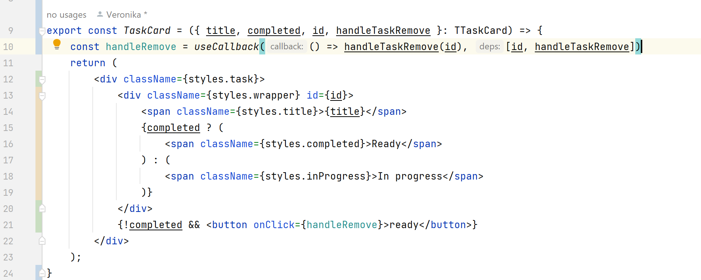
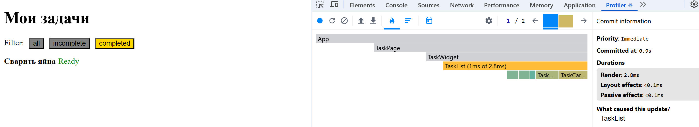
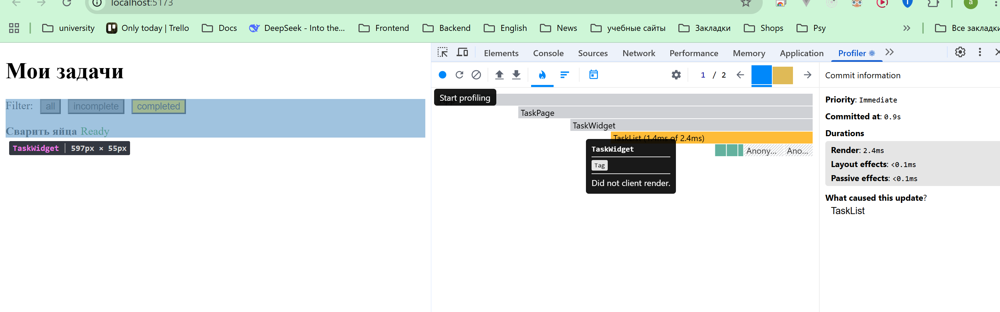

1. При переключении кнопок/вкладок фильтров они каждый раз перерисовывались (голубые квадратики, я всего лишь нажала на incomplete, а перерисовались все три кнопки):
   Если обернуть `FilterButton` в `useMemo` то кнопки рисуются быстрее, но все еще рисуются "зря":
   
   Если в `TaskList` в `onClick` передавать заранее объявленную функцию, то кнопки зря не перерисовываются:
   На скрине видно, что перерисовались только две кнопки, т.к. у них изменилось свойство `active`:
2. Без `memo` `TaskCard` перерисовывается просто при переключении между фильтрами, хотя таски не меняли свое состояние:  
   c `memo` при переключении фильтров, не отмечая таски выполненными, ситуация такая: таски - anonymous не перерисовывались 
